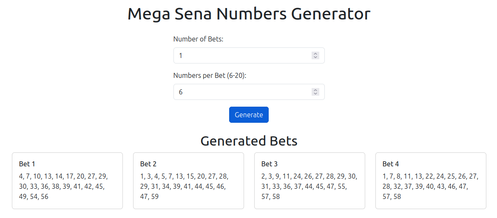

# Mega Sena Numbers Generator

Este projeto é uma aplicação baseada em Java Spring Boot com Thymeleaf para gerar números aleatórios para apostas da Mega Sena. A interface é estilizada com Bootstrap para uma aparência limpa e responsiva.

## Funcionalidades

- Gerar números aleatórios para apostas da Mega Sena.
- Exibir os resultados organizados em 4 colunas.
- Interface responsiva utilizando Bootstrap.
- Permite ao usuário definir quantas apostas deseja gerar.

## Tecnologias Utilizadas

- **Java 17**
- **Spring Boot**
- **Thymeleaf**
- **Bootstrap 5**
- **Maven**

## Pré-requisitos

- Java 17 ou superior.
- Maven 3.8 ou superior.

## Como Executar

1. Clone o repositório:
    ```bash
    git clone https://github.com/seu-usuario/mega-sena-generator.git
    cd mega-sena-generator
    ```

2. Compile e execute a aplicação:
    ```bash
    mvn spring-boot:run
    ```

3. Acesse a aplicação no navegador em: [http://localhost:8080](http://localhost:8080)

## Tela de Exemplo

Abaixo está a captura de tela da aplicação gerando apostas da Mega Sena:



## Configuração do Thymeleaf

O layout do Thymeleaf exibe os números organizados em 4 colunas, tornando a interface limpa e responsiva. O código do modelo pode ser encontrado em `src/main/resources/templates/generate.html`.

### Exemplo de Layout Thymeleaf

```html
<div class="row row-cols-1 row-cols-md-4 g-4">
    <div class="col" th:each="bet : ${bets}">
        <div class="card">
            <div class="card-body">
                <h6 class="card-title" th:text="${bet.key}"></h6>
                <p class="card-text" th:text="${#strings.arrayJoin(bet.value, ', ')}"></p>
            </div>
        </div>
    </div>
</div>

